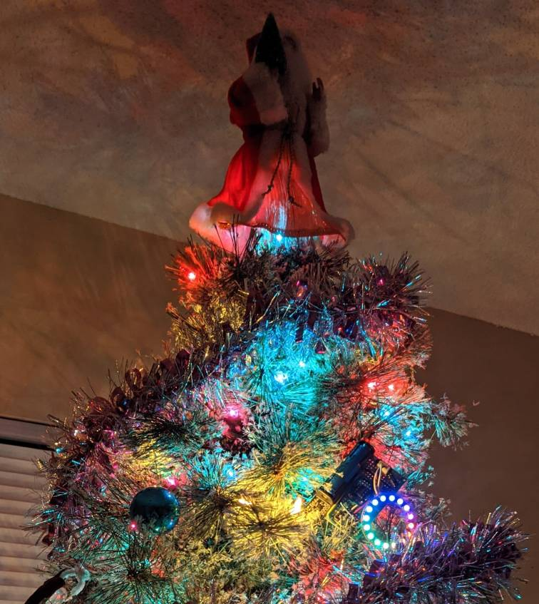
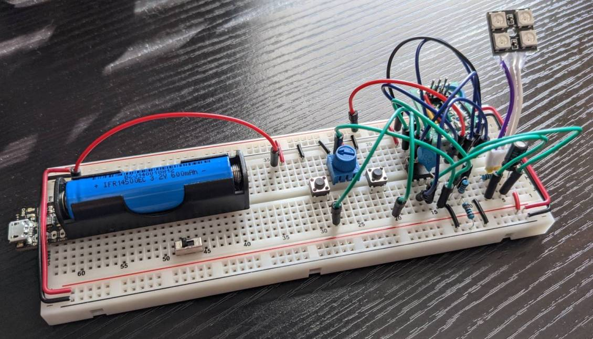
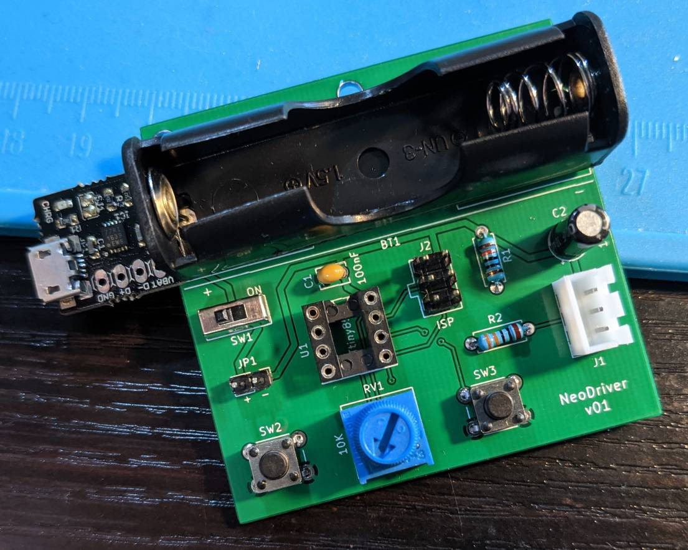
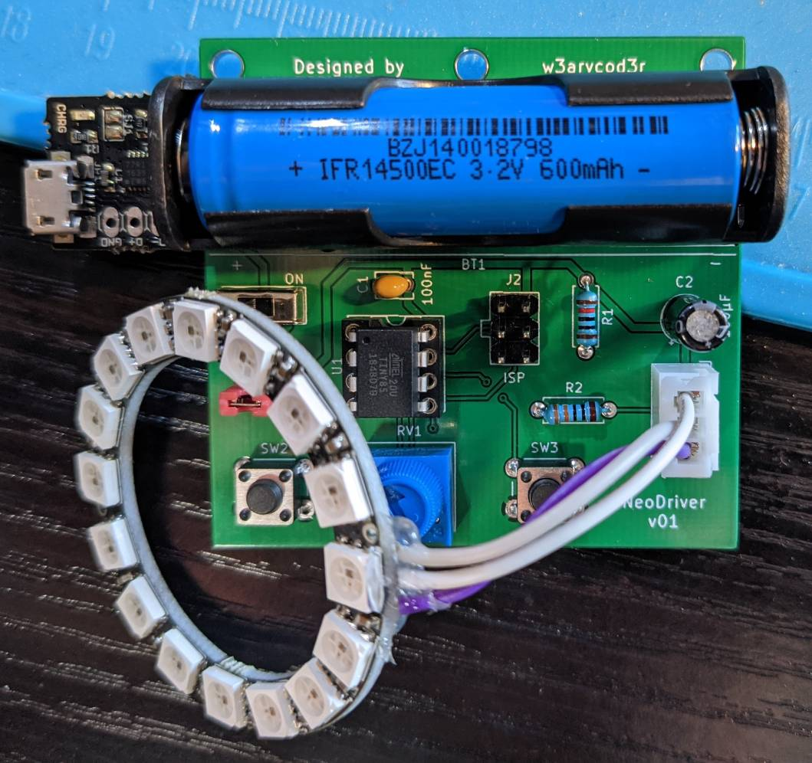
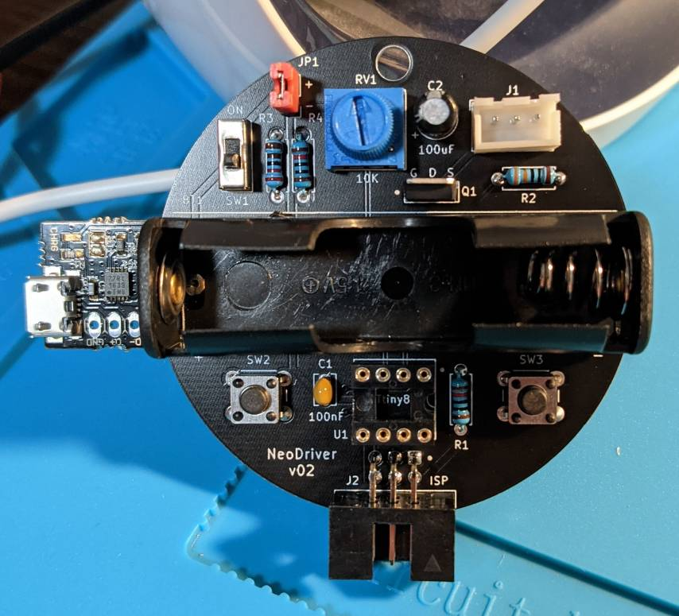
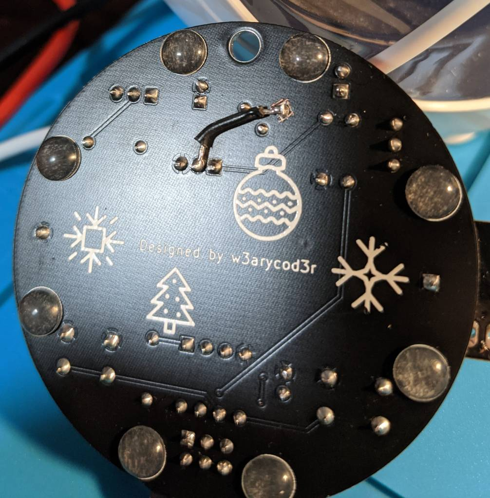
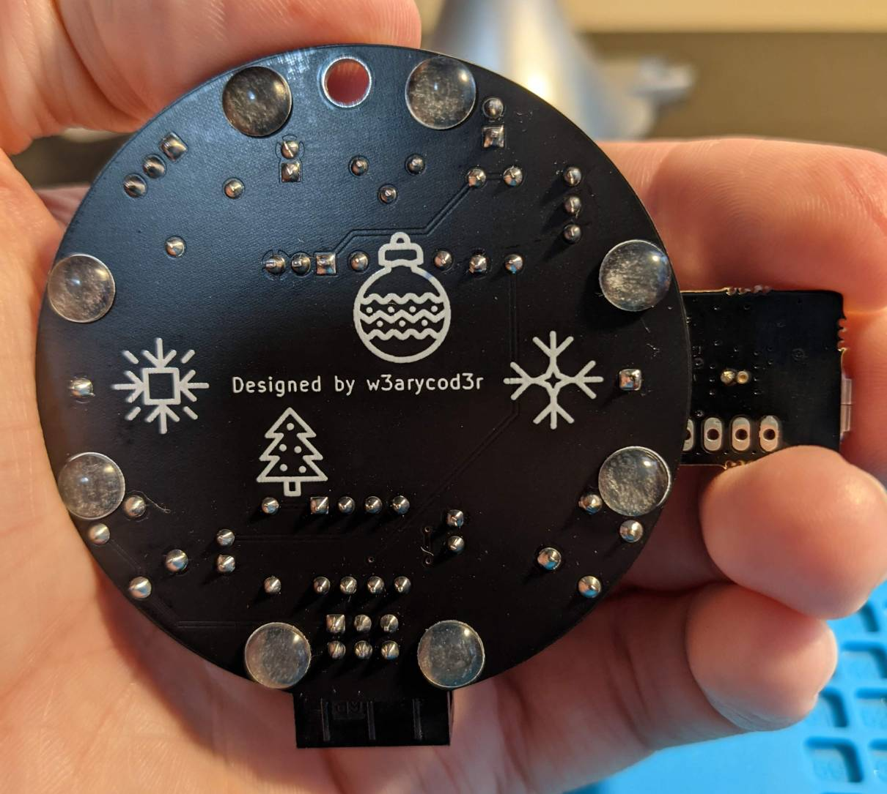

# neodriver-ornament
# Demo
<p align="center">
     
</p>

<p align="center">
    
</p>

<p align="center">
    
</p>

# Goal
Create a rechargeable, battery-powered Christmas ornament using Adafruit's ["NeoPixels"](https://www.adafruit.com/category/168) (WS2812B RGB addressable LEDs). The ornament should contain a hole for a ribbon to hang on a tree. The ornament should be "small enough" as to not look out of place on a tree. It should be balanced and as symmetrical as possible so that it will hang straight. The weight should be comparable to other common ornaments. The battery should last for several days/weeks of continuous use.

Animations should be colorful, interesting, and eye-catching. It is acceptable to have a low duty cycle, i.e. the LEDs can have a short ON time playing an animation followed by a longer OFF time to save power. 
# Hardware
For the LEDs, I found various carrier boards of the [WS2812B](docs/WS2812B/WS2812B.pdf) RGB LEDs on eBay. I found square matrices, rings, and circles of various sizes. Search for "WS2812B Ring" or "WS2812B 5X5". Most of these boards simply had the LEDs soldered on one side with appropriate decoupling caps and traces connecting them all in a chain. The important connections (VDD, DIN, & GND) were exposed on the other side, to surface mount pads. I used small stranded wires from ribbon cables to fashion my own cables and connectors for each board. I soldered the wires to the pads, providing some strain relief with hot glue, then crimped a 3P JST-XH female connector to the other end. I would use a male 3P JST-XH on my driver board and connect the LED boards using this interface. This would make it easy to switch out and test different LED boards. Making these connectors was tedious and the solder connections are quite fragile.

<p align="center">
   
</p>

I chose the [ATtiny85](https://www.microchip.com/en-us/product/ATTINY85) for the microcontroller, as it is small, inexpensive, has various low-power modes, is available in a DIP-8 package, has sufficient I/O, and has some Arduino IDE support with extensions. I wanted all my components to be through-hole for easy assembly. I planned to have a potentiometer for brightness control, two pushbuttons for changing animations, and a power switch.

Later, I would discover that the NeoPixels drew several milliamps of current, even when they were switched OFF (commanded to show RGB = 0,0,0). So, I picked a nMOS power transistor to switch the GND of the NeoPixels using the microcontroller. I also switched the GND on the pot to save additional power. 

For the battery, I found a neat module which combines a LiFePO4 cell, holder, and USB charge circuit into a single, easy to solder PCB:

https://www.tindie.com/products/silicognition/lifepo4weredusb/  

I wanted to be able to reprogram the microcontroller after the device was assembled, so I included a AVR-ISP header on the board. Not quite as convenient as the USB connector on an Arduino, but good enough for my purposes. This means that I will need a AVR-ISP programmer. I used the official [Atmel-ICE](https://www.microchip.com/en-us/development-tool/ATATMEL-ICE) programmer. I looked into some of the third-party programmers, but I wasn't happy with the way they handled powering the board. The Atmel-ICE does not power the board but instead samples the VDD line and converts the 5V USB programming signals to the voltage level your board uses.


# Schematic
<p align="center">
    
</p>

A few notes about the schematic: 
1. I added a jumper in series with the battery positive terminal so I could easily measure power consumption of the entire circuit. This was very useful later during my power optimization efforts.
2. C1 is a decoupling cap for the micro, which will be placed close to the power pins during layout.
3. The micro is at the heart of the circuit, reading the switches and pot inputs, driving the single data line for the NeoPixels, and controlling the nMOS power transistor. Internal pull-ups are used for the switches.
4. R2 is in series with the NeoPixel DIN, based on advice from Adafruit. In theory, this resistor reduces the reflections (sharp over-voltage peaks) on this high-speed digital data line.
5. The I/O lines are shared with the programming lines, with isolation resistors where necessary (R3). There is a pull-up (R1) on the reset line, so that the micro is only reset when the programmer brings the line low.
6. R5 and C3 form a low-pass filter on the analog pot line, to remove any noise which may be on this line. The ADC inside the micro is configured to sample this pin.
7. R4 is a pull-down resistor so that the nMOS is OFF by default. The micro will bring the gate of the nMOS high in order to turn on the transistor and allow the NeoPixels to be powered.
8. There is a bulk cap (C2) close to the NeoPixel connector to buffer the power for the LEDs. These LEDs switch ON and OFF quickly and they require large spikes of current from the power rail. The cap will provide this current while smoothing out the voltage.
9. I picked the IRLU8743PBF for Q1 based on the convenient through-hole package (I-PAK), low ON resistance (~3.1 mOhms), small size, and low threshold voltage (~1.9V). However, it is a bit pricy. Others could certainly work in its place.

# PCB Design
## Breadboard & Protoboard
First, I soldered together a prototype on a piece of protoboard, based on my initial schematic. I also created a breadboard version for easy experimentation.

<p align="center">
    
</p>

This wasn't very attractive, and it didn't hang very well on the tree, so I sought out to design a custom PCB. This was my first PCB design, so I learned a lot along the way. I decided to use KiCad, since it is FOSS and very beginner friendly. I watched and followed along with Digi-Key's [YouTube tutorial](https://www.youtube.com/playlist?list=PLEBQazB0HUyR24ckSZ5u05TZHV9khgA1O) on KiCad. Should you want to get a batch of these boards fabbed, you can find the [gerbers](kicad/export/gerbers) in the repo.

## v01
The layout for v01 of the PCB design was heavily based on the protoboard layout, for simplicity. I used [JLCPCB](https://jlcpcb.com/) to get the boards manufactured.  

<p align="center">
      
</p>


## v02
For v02, I made several improvements:
1. Use a circular shape for smaller overall footprint and hopefully better balance on the tree
2. Place the battery (heaviest component) for better balance.
3. Replace the straight ISP header with a right angle one so that the port can be accessed even when the LEDs are hot-glued in place.
4. Add the nMOS transistor to switch the NeoPixel GND when in a low-power state.
5. Add a single hole at the top to attach a ribbon for hanging purposes.
6. Add rubber feet on bottom so the board can sit on a table without scratching the table or shorting connections.
7. Add some festive PCB art on the back! :D  

<p align="center">
       
</p>
 

I discovered that the potentiometer was burning some power as well. Since I didn't need to read the value of the pot while in a low-power state, I decided to switch the GND of the pot using the same nMOS for the NeoPixels. I cut the GND connection on the pot and added a bodge wire to fix this, shown below:



## v03
For v03, I made a few minor improvements:
1. Rewire the pot so that the GND is switched along with the NeoPixel GND.
2. Rotate some components 45 degrees so that they are easier to access when the LEDs are fixed on top.
3. Add RC low-pass filter on the analog pot line, to filter out switching noise from NeoPixel data signal.
4. Enlarge pads on battery terminals for better connection

<p align="center">
      
</p>

# Software
The main sketch [neo_driver_app.ino](arduino/neo_driver_app/neo_driver_app.ino) has several important functions:
1. Process HMI inputs (left, right switches and potentiometer). The switches can scroll through all the animations and the pot can adjust the brightness of the LEDs.
2. LED adjustment mode: Holding one of the switches will cause the device to enter a LED adjustment mode. In this mode, pressing the left or right switches will decrement or increment the number of LEDs controlled by the device. This allows different sizes of matrices or rings to be used. Holding one of the switches again will save your adjustment into EEPROM memory, so that it is retained between power cycles.
3. Shuffle mode: Play the defined animations in a random sequence, without user intervention. After playing an animation, enter a low-power mode with micro in deep sleep, LEDs and pot OFF. The sleep time is variable, depending on the length of the last played animation. Wakeup from sleep is achieved using the watchdog timer. Also, pressing one of the switches will wake the device as well.
4. Battery management: Monitor for a low battery condition by measuring VDD on the micro and checking it against a set threshold. When this condition occurs, a flashing red "low battery" icon is shown for a few seconds and the device enters the low-power mode without the watchdog timer set. Therefore, the device will remain in low-power mode until it is woken with a switch or a power cycle. If the battery is still low, the device will repeat the "low battery" animation and return to the low-power mode. The device will be "locked out" until the battery voltage rises to a reasonable level (as a result of the user charging the battery).

I wrote the code with modularity in mind, so that it would be easy to add or remove animations. Also most parameters are pulled out into constants or data structures, so they can be easily tweaked.

## Animations
### Scrolling Text
In the EEPROM, I had space for 85 ASCII characters in a 5x5 bitmap font. The top 3 bits of each byte were unused. Most notably, I covered all the digits, capital letters, and some punctuation marks and symbols. In the program memory (flash), I store a few message strings in ASCII. This animation can select one of the messages and scroll it across the matrix in one color or in a flowing "rainbow" color effect.

Rendering a 5x5 framebuffer containing a character onto the 5x5 matrix was tricky because the LEDs are indexed sequentially, in a zig-zag pattern chosen for convenient routing on the matrix PCB. Below is an illustration of the index problem, with my choice for numbering rows and columns:

<p align="center">
  
</p>

I came up with the following conversion equations for (row,col) to pixel index, depending on the orientation of the matrix (which determines location of first pixel and the pattern direction):
```C++
// Calculate pixel index from (row,col)
    #if   ANIM_ROT_SEL == 1
        if (u8_col % 2 == 0) { u8_pixIndex = u8_col*5     + 4-u8_row; }
        else                 { u8_pixIndex = u8_col*5     +   u8_row; }
    #elif ANIM_ROT_SEL == 2
        if (u8_row % 2 == 0) { u8_pixIndex = (4-u8_row)*5 + 4-u8_col; }
        else                 { u8_pixIndex = (4-u8_row)*5 +   u8_col; }
    #elif ANIM_ROT_SEL == 3
        if (u8_col % 2 == 0) { u8_pixIndex = (4-u8_col)*5 +   u8_row; }
        else                 { u8_pixIndex = (4-u8_col)*5 + 4-u8_row; }
    #elif ANIM_ROT_SEL == 4
        if (u8_row % 2 == 0) { u8_pixIndex = u8_row*5     +   u8_col; }
        else                 { u8_pixIndex = u8_row*5     + 4-u8_col; }
    #endif
```
### SARS-CoV-2 Blink
For this animation, I was inspired by PaulKlinger's [Virus Blinky](https://github.com/PaulKlinger/freeform-virus-blinky). I created two versions of this animation, one using a "quarter" pattern, suitable for rings, and one using letters, suitable for the 5x5 matrix.

The quarter pattern blinks through the [RNA](https://en.wikipedia.org/wiki/RNA) sequence of the [SARS-CoV-2](https://en.wikipedia.org/wiki/Severe_acute_respiratory_syndrome_coronavirus_2) virus, lighting up one quarter of the LEDs in a specific color corresponding to the current [base](https://en.wikipedia.org/wiki/Nucleobase).
The letter pattern instead blinks the letters corresponding to the base, again with a corresponding color.

The animation blinks a few letters of the sequence, then goes to sleep. When this animation is chosen again, it will retain its place in the sequence and continue from there. Due to space constraints, I was only able to store the first 320 bases of the sequence. This is sufficient to create an interesting, random looking animation.
### Frame Sequences
Since many of the ASCII chars in the range I selected were unused in my message strings, I used these for frames of animation instead. First, I created the animations using [GIMP](https://www.gimp.org/) on my PC. Once I was happy with how they looked, I copied them bit by bit into the font memory. I created a struct in the main program that contains the parameters for each animation. Each animation could be defined as STATIC or SHIFT mode. STATIC is a non-moving animation, fixed in place, stepping through a frame sequence. SHIFT is a moving animation, scrolling in some direction while also stepping through frames.

As an example, below is the (annotated) animation data for the "Pacman" animation.
```C++
// Frame ASCII sequences
const char PROGMEM sz_frames1[] = "gh";     // Pacman  ( 12   : gh  )  -- Which ASCII chars in the char set correspond to the animation frames in memory?

// Frame sequence config data

// Sequence 1 - Pacman
FRAMES_CONFIG_T st_sequence1 = {
    200,                         // uint16_t u16_frameStep_msec;  -- "on" time for each frame in the sequence.
    COLOR_YELLOW,                // uint32_t u32_color;           -- Color. Set to 0 for dynamic effect.
    sz_frames1,                  // uint8_t* pu8_frames;          -- Pointer to the frame sequence array stored in flash.
    FRAMES_MODE_SHIFT,           // uint8_t  u8_mode;             -- Mode of operation. A value from _FRAMES_MODE_T.

    // STATIC params
    0,                           // uint8_t  u8_seqRepeatCnt;     -- Number of times to repeat the frame seq for each anim cycle in STATIC mode.

    // SHIFT params
    2,                           // uint8_t  u8_frameShiftSync;   -- Number of frames between shifts, in SHIFT mode.
    -4,                          // int8_t   i8_startPosX;        -- Init X,Y position. Should start onscreen.
    0,                           // int8_t   i8_startPosY;        -- 
    1,                           // int8_t   i8_shiftStepX;       -- The X shift to perform on each shift step. Can be pos, neg, or zero.
    0                            // int8_t   i8_shiftStepY;       -- The Y shift to perform on each shift step. Can be pos, neg, or zero.
};
```
## Challenges
The biggest challenge was space. The ATtiny85 only has 8KB of code space and 512B of EEPROM. I used EEPROM to store bitmap font data used for the scrolling messages, as well as the SARS-CoV-2 base data for the associated animation. I stored message strings and other animation sequence data in flash. To get all of this to fit, I had to carefully optimize the code for size. I had to trim down the Adafruit NeoPixel library, removing unnecessary features and sizing all of the variables as small as possible. You can see the modifications I made in [neo_pixel_slim.h](arduino/neo_driver_app/neo_pixel_slim.h) and [neo_pixel_slim.cpp](arduino/neo_driver_app/neo_pixel_slim.cpp). Also, I had to avoid some bloated Arduino functions and replace them with direct AVR register manipulations.

I used various commands from the AVR toolchain (see [get_size_info.bat](arduino/neo_driver_app/get_size_info.bat)) to view the size and disassembly of each portion of my code. This was essential during my size optimization efforts, as it showed me where to focus my attention.

# Compile & Flash
## Environment setup
You can use either the [Arduino IDE](https://www.arduino.cc/en/software) or the [arduino-cli](https://arduino.github.io/arduino-cli/latest/installation) (command line interface) to compile and flash the [code](arduino) in this repo. My build scripts use arduino-cli.  

For both options, you will need to install:
1. The [ATTinyCore](https://github.com/SpenceKonde/ATTinyCore) to get Arduino support for the ATtiny85.
2. The Adafruit [NeoPixel Library](https://github.com/adafruit/Adafruit_NeoPixel).

## Fuses
The configuration fuses inside the ATtiny85 need to be properly set for the code to run as expected. This only needs to be done once. You can do this inside of the Arduino IDE:
1. Change your board with Tools -> Board -> ATTinyCore -> ATtiny25/45/85 (No bootloader)
2. Select Tools -> Chip -> ATtiny85
3. Change your programmer with Tools -> Programmer -> Atmel-ICE   *or choose another programmer you intend to use*
4. Select Tools -> Clock Source -> 8 MHz (internal)
6. Select Tools -> Save EEPROM -> EEPROM retained
7. Select Tools -> B.O.D Level -> B.O.D. Enabled (1.8v)
8. With programmer and board plugged in, select Tools -> Burn Bootloader to set the hardware fuses

## eep_data_write
Font and animation data is stored in the 512B EEPROM of the ATtiny85. So first, the [eep_data_write](arduino/eep_data_write) sketch should be flashed and ran on the hardware. This only needs to be done once. If you are using arduino-cli and the Atmel-ICE programmer, simply run build.bat in the sketch folder.

If you are using the IDE:
1. Open the .ino file inside the IDE.
2. Change your board with Tools -> Board -> ATTinyCore -> ATtiny25/45/85 (No bootloader)
3. Select Tools -> Chip -> ATtiny85
4. Change your programmer with Tools -> Programmer -> Atmel-ICE   *or choose another programmer you intend to use*
5. With programmer and board plugged in, upload using the "right arrow" upload button.

This sketch will flash the required data into the EEPROM and verify it. The first NeoPixel flashes green to indicate success.

## neo_driver_app
The [neo_driver_app](arduino/neo_driver_app) sketch is the main program. Follow the same steps as above to flash this sketch to your hardware.

# Useful Links
https://github.com/PaulKlinger/freeform-virus-blinky  
http://batchout.blogspot.com/2018/02/five-by-five-my-5x5-pixel-font.html  
https://www.ebay.com/itm/224246288057  

